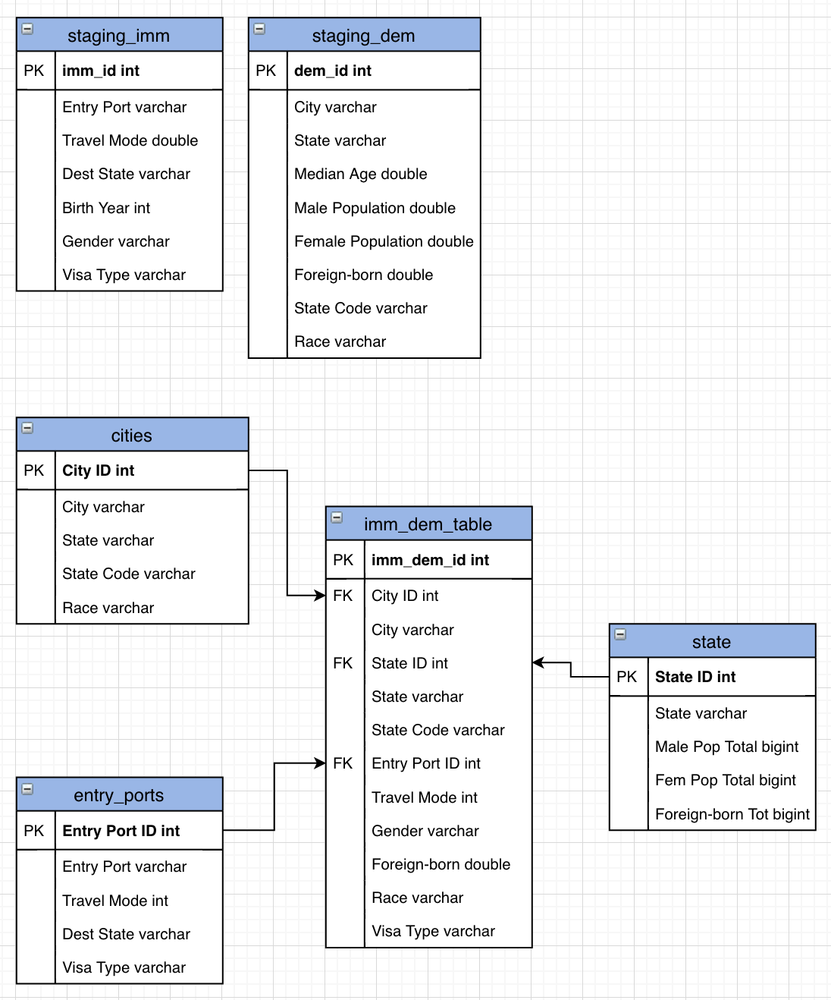

# Data Capstone Project
The purpose of this data engineering capstone project is to combine what was learned throughout Udacity's Data Engineer Nanodegree Program.

## Project Instructions
As a guideline, the project is broken down into a series of steps:

**Step 1: Scope and Gather Data**
* Identify and gather data
  - The data used for this project is Immigration and U.S. City Demographic Data (discussed [later](#Datasets) in this README)
* Explain end-use cases to prep data
  - The data used for this project is prepared for use with analytics tables. The broader dataset is broken down into several tables to better query against.
  - Specifically, I'd like the data to be used to answer questions regarding:
    - Port of entry for immigrants (state, gender, visa type)
    - US city demographics such as male population, female population, and foreign-born residents in respective cities
    - As a more technical aspect, I included entry port data so that someone may be able to look up entry ports within their respective states

**Step 2: Explore and Assess the Data**
* Explore the data to identify data quality issues (e.g. missing values, duplicate data, etc.)
  - Below are the schemas for the datasets before cleanup:
  
    **Immigration data**
    ```
    root
     |-- cicid: double (nullable = true)
     |-- i94yr: double (nullable = true)
     |-- i94mon: double (nullable = true)
     |-- i94cit: double (nullable = true)
     |-- i94res: double (nullable = true)
     |-- i94port: string (nullable = true)
     |-- arrdate: double (nullable = true)
     |-- i94mode: double (nullable = true)
     |-- i94addr: string (nullable = true)
     |-- depdate: double (nullable = true)
     |-- i94bir: double (nullable = true)
     |-- i94visa: double (nullable = true)
     |-- count: double (nullable = true)
     |-- dtadfile: string (nullable = true)
     |-- visapost: string (nullable = true)
     |-- occup: string (nullable = true)
     |-- entdepa: string (nullable = true)
     |-- entdepd: string (nullable = true)
     |-- entdepu: string (nullable = true)
     |-- matflag: string (nullable = true)
     |-- biryear: double (nullable = true)
     |-- dtaddto: string (nullable = true)
     |-- gender: string (nullable = true)
     |-- insnum: string (nullable = true)
     |-- airline: string (nullable = true)
     |-- admnum: double (nullable = true)
     |-- fltno: string (nullable = true)
     |-- visatype: string (nullable = true)
    ```

    **US City Demographic**
    ```
    root
     |-- City: string (nullable = true)
     |-- State: string (nullable = true)
     |-- Median Age: double (nullable = true)
     |-- Male Population: double (nullable = true)
     |-- Female Population: double (nullable = true)
     |-- Total Population: long (nullable = true)
     |-- Number of Veterans: double (nullable = true)
     |-- Foreign-born: double (nullable = true)
     |-- Average Household Size: double (nullable = true)
     |-- State Code: string (nullable = true)
     |-- Race: string (nullable = true)
     |-- Count: long (nullable = true)
    ```

* Document cleaning steps
  - Through inspection of the data, some column names in the immigration dataset were confusing, after consulting the source website, assumptions were made about what the data contained in specific columns. As such, these columns were renamed in the final tables.
  - I first selected relevant column necessary for my end result:
  ```
  dem_data = df2_spark.select(
    ["City", "State", "Median Age", "Male Population",
     "Female Population", "Foreign-born", "State Code", "Race"]
  )

  imm_data = spark.sql("""
    SELECT i94port AS `Entry Port`,
           i94mode AS `Travel Mode`,
           i94addr AS `Dest State`,
           CAST(biryear AS INT) AS `Birth Year`,
           gender AS Gender,
           visatype AS `Visa Type`
    FROM imm_data
  """)
  ```

  - This resulted in the following schemas:
  **Immigration data**
  ```
  root
   |-- Entry Port: string (nullable = true)
   |-- Travel Mode: double (nullable = true)
   |-- Dest State: string (nullable = true)
   |-- Birth Year: integer (nullable = true)
   |-- Gender: string (nullable = true)
   |-- Visa Type: string (nullable = true)
  ```

  **US City Demographics**
  ```
  root
   |-- City: string (nullable = true)
   |-- State: string (nullable = true)
   |-- Median Age: double (nullable = true)
   |-- Male Population: double (nullable = true)
   |-- Female Population: double (nullable = true)
   |-- Foreign-born: double (nullable = true)
   |-- State Code: string (nullable = true)
   |-- Race: string (nullable = true)
  ```

  - With these new columns, I searched through the data for `null` and `NaN` values and removed them.
  - Afterword I searched for duplicate rows and deleted those.

**Step 3: Define the Data Model**
* Conceptual Data Model
  - For the data model, I chose to separate the data into a star schema. I chose this model because the model to me seemed convenient to extract data and work with tables individually or together (in the `imm_dem` table)
  - Below is the Schema for the data:



* Data Pipeline
  - Below is the DAG to map out the data pipeline:


**Step 4: Run ETL and Model the Data**
- The ETL and Pipeline are created using the project files.

## Datasets
The following datasets are used in the project:
- **I94 Immigration Data:** This data comes from the US National Tourism and Trade Office. [This](https://travel.trade.gov/research/reports/i94/historical/2016.html) is where the data comes from.
- **U.S. City Demographic Data:** This data comes from OpenSoft. It can be found [here](https://public.opendatasoft.com/explore/dataset/us-cities-demographics/export/).
